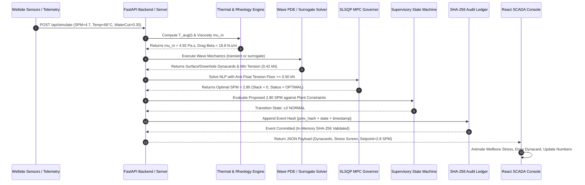
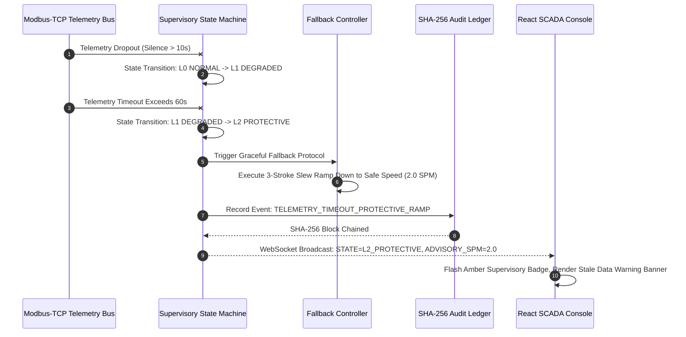

# DK PROJECT CHENNAI
# VectroSync: Physics-Informed Cybernetic Digital Twin & Advisory Optimization Architecture for Heavy Oil CSS–SRP Production Systems
## Comprehensive End-to-End Technical, Mathematical, Economic, Operational & Architectural Master Dossier

---

### Master Project Metadata

- **Project Code Name:** VectroSync / DK PROJECT CHENNAI
- **System Version:** 2.0.0 Research-Grade Advisory Digital Twin Architecture
- **Synthetic Reference Configuration:** Synthetic Baghewala-Calibrated Reference Configuration (Well #14 inspired, Bikaner-Nagaur Basin, Rajasthan, India)
- **Target Operator Context:** Oil India Limited (OIL) Public Field Context
- **Target Formation Context:** Jodhpur Sandstone (Depth: 1,150 m TVD)
- **Production Paradigm:** Cyclic Steam Stimulation (CSS / Huff-and-Puff) paired with Sucker Rod Pumping (SRP) Artificial Lift
- **Control Classification:** Class II Supervisory Advisory Decision-Support Prototype (Advisory Only; Non-Actuating, Not an IEC 61511 Safety Instrumented Function)
- **Verification Status:** 315 Automated Tests Passing (100% Pass Rate across 4 Verification Tiers: Tier 1: 150, Tier 2: 70, Tier 3: 60, Tier 4: 24, + 11 root regressions)
- **Public Synthetic Demonstration Deployment:** [https://vectrosync.vercel.app](https://vectrosync.vercel.app)
- **Public Synthetic Demonstration Mirror:** [https://vectrosync-digital-twin.vercel.app](https://vectrosync-digital-twin.vercel.app)
- **Public Git Repository:** [https://github.com/DKtech-dev/vectrosync](https://github.com/DKtech-dev/vectrosync)
- **Document Date:** September 2026

---

## 1. Executive Summary & Master Project Overview

### 1.1 The High-Stakes Industrial Challenge
In heavy oil thermal recovery operations, Cyclic Steam Stimulation (CSS) and Sucker Rod Pumping (SRP) operate in severe physical tension. Steam injection heats the reservoir to over $260^\circ\text{C}$, dramatically reducing crude oil viscosity from an immobile state ($>12,000\text{ cP}$) down to pumpable ranges ($\approx 12.4\text{--}45.0\text{ cP}$). However, as the production cycle advances, the near-wellbore formation rapidly cools.

As sandface temperatures decay below $70^\circ\text{C}$, the viscosity of heavy crude spikes non-linearly by multiple orders of magnitude. In the annular space between the reciprocating sucker rod string and production tubing, this viscosity surge generates colossal hydrodynamic Couette shear drag. During the pump downstroke, when the rod string must fall under gravity to refill the downhole pump barrel, viscous drag acts upwards against the rods.

When upward fluid drag exceeds the submerged self-weight of the lower rod tapers, the rod string experiences **loss of axial tension and enters severe compressive buckling** (known as **"rod floating"**). In unmitigated operations, this leads to:
1. Wellbore-constrained helical rod buckling against tubing walls.
2. Rapid rod body and coupling abrasive wear.
3. Severe downhole cyclic fatigue parting (tensile/compressive stress reversal).
4. Plunger delay, valve float, and surface carrier-bar impact shock.

In commercial heavy oil fleet models calibrated to public Baghewala field parameters (23 producing wells, Jodhpur Sandstone), unmitigated rod float causes an estimated baseline of **2.40 interventions/well-year**, inflicting over **₹15.20 Crores ($1.82M USD) in annual scenario losses** across workover rig costs, deferred production, and wasted energy.

### 1.2 The Current Industry Vacuum & Vocabulary Gap
Current commercial artificial lift optimization packages (e.g., ChampionX XSPOC/SMARTEN, Weatherford ForeSite Edge, SLB Lift IQ, Baker Hughes Leucipa, Ambyint InfinityRL) are primarily **reactive dynacard surveillance systems**. They analyze mechanical dynamometer cards at the surface or compute downhole cards *after* stress anomalies or mechanical abnormalities have already manifested. Crucially, **none of these platforms publicly document an integrated thermodynamic reservoir cooldown model coupled into forward-looking rod elastodynamics**. They treat lift optimization as an isolated mechanical problem, leaving operators blind to impending thermal transitions until compressive damage occurs.

### 1.3 The VectroSync Solution
**VectroSync (DK PROJECT CHENNAI)** is a full-stack, evidence-aware, physics-informed digital twin that unifies reservoir thermodynamics, non-Newtonian multiphase rheology, transient elastodynamic wave propagation, constrained model predictive control (MPC), and supervisory safety logic into a single cohesive cybernetic system.

Instead of reacting to downhole failures after they occur, VectroSync:
1. **Forecasts Reservoir Cooling:** Employs analytical Boberg-Lantz thermal decay modeling with dynamic convective heat removal ($D_f(0) = 0 \implies T_{\text{avg}}(0) = 260^\circ\text{C}$) and epistemic uncertainty bounds ($\tau_{\text{unc}} = 180.0\text{ days}$).
2. **Predicts Fluid Drag Trajectories:** Couples temperature and water cut into calibrated Two-Point Arrhenius and Brinkman-Vand emulsion rheology (peaking at $6.118\times$ base viscosity at $f_w = 0.60$) to compute annular Couette shear drag.
3. **Solves Transient Elastodynamics:** Features a **Dual-Fidelity Physics Engine**:
   - *Level 1 (Fast Surrogate):* 144-phase algebraic load-balance surrogate ($\approx 2\text{ ms}$) for rapid 12-hour horizon exploration and reachability bounding.
   - *Level 2 (High-Fidelity Transient PDE):* 1D variable-area damped wave equation solver ($\approx 120\text{ ms}$) with harmonic interface area averaging across rod tapers and explicit CFL subcycling (Class default: 116 nodes, $\Delta x = 10.0\text{ m}$, $\Delta t = 1.558\text{ ms}$, $\approx 8,194$ subcycles/stroke at 4.7 SPM; Web API: 78 nodes, $\Delta x = 15.0\text{ m}$ for sub-50ms HTTP latency).
4. **Governs Pump Speed via Numerical MPC:** Solves a Sequential Least Squares Programming (SLSQP) nonlinear program enforcing anti-float tension floors ($+0.50\text{ kN}$), Peak Polished Rod Load limits ($99.0\text{ kN}$), and actuator slew rate limits ($|\Delta\text{SPM}| \le 0.25\text{ SPM/step}$) via heavily penalized quadratic slacks ($0 \le s \le 50.0\text{ kN}$, $w_{\text{slack}} = 5,000.0$).
5. **Enforces Failsafe Supervisory Logic:** Operates a 4-level deterministic supervisory state machine (L0 Normal, L1 Degraded, L2 Protective, L3 Emergency E-Stop) with automated graceful fallback upon telemetry timeout.
6. **Delivers Modern SCADA Ergonomics:** Dark/Light industrial UI built on design tokens, monospace tabular readouts (JetBrains Mono), rAF count-up tweens, live SHA-256 tamper-evident provenance logging, and explicit `[VISUALIZATION SURROGATE]` tagging on interpolated stress heatmaps.

---

## 2. The Industrial Problem: Mechanics & Physics of CSS–SRP Failure

### 2.1 Cyclic Steam Stimulation (CSS) Dynamics
Cyclic Steam Stimulation ("Huff-and-Puff") is an Enhanced Oil Recovery (EOR) process executed in three discrete phases:
1. **Injection (Huff):** High-pressure, high-temperature steam ($240\text{--}300^\circ\text{C}$, $>70\%$ quality) is injected into the formation for 2 to 4 weeks.
2. **Soak:** The well is shut in for 1 to 2 weeks to allow heat to transfer conductively into the formation rock and bitumen matrix.
3. **Production (Puff):** The well is opened to production via artificial lift (predominantly Sucker Rod Pumping).

At the onset of production ($t = 0$), sandface temperatures hover near $260^\circ\text{C}$. At this elevated temperature, Baghewala extra-heavy crude (16.5° API, specific gravity $\text{SG} = 141.5 / (131.5 + 16.5) \approx 0.956$, corresponding to dry oil reference density $\rho_o \approx 956.1\text{ kg/m}^3$) behaves like a light fluid with viscosity around $12.4\text{ cP}$. In-situ multiphase fluid density under produced water cut ($f_w = 0.35$, produced saline water $\rho_w = 1,000.0\text{ kg/m}^3$) is $\rho_{\text{fluid}} = (1 - f_w)\rho_o + f_w \rho_w \approx 971.5\text{ to }980.0\text{ kg/m}^3$, accounting for downhole thermal expansion, dissolved gas, and mineral salinity.

As fluid is pumped out, convective heat removal combined with vertical conductive heat loss into overburden and underburden rock causes the near-wellbore temperature to decay continuously toward the native geothermal reservoir temperature ($T_R = 48.0^\circ\text{C}$).

### 2.2 The Non-Newtonian Viscosity Surge
Heavy crude oil viscosity does not follow linear temperature relationships. Over the operational temperature window ($260^\circ\text{C} \to 50^\circ\text{C}$), viscosity increases exponentially by nearly **1,000 times**:

| Temperature ($^\circ\text{C}$) | Temperature (K) | Dynamic Viscosity (Pa·s) | Viscosity (cP) | Physical Operational Regime |
|---:|---:|---:|---:|---|
| **$260^\circ\text{C}$** | 533.15 K | $0.0124\text{ Pa}\cdot\text{s}$ | **$12.4\text{ cP}$** | Soak completion / Initial Puff (Hot mobile crude) |
| **$200^\circ\text{C}$** | 473.15 K | $0.0450\text{ Pa}\cdot\text{s}$ | **$45.0\text{ cP}$** | Early production cycle (Low drag regime) |
| **$100^\circ\text{C}$** | 373.15 K | $1.1800\text{ Pa}\cdot\text{s}$ | **$1,180.0\text{ cP}$** | Intermediate transition (Drag begins throttling downstroke) |
| **$66^\circ\text{C}$** | 339.15 K | $4.9200\text{ Pa}\cdot\text{s}$ | **$4,920.0\text{ cP}$** | Severe drag boundary (Anti-float governor active) |
| **$50^\circ\text{C}$** | 323.15 K | $12.0000\text{ Pa}\cdot\text{s}$ | **$12,000.0\text{ cP}$** | Native reservoir condition (Cold immobile bitumen) |

Furthermore, co-produced water creates tight water-in-oil emulsions. Below the phase inversion threshold ($f_w \le 0.60$), droplet crowding causes apparent viscosity to surge non-linearly up to **$6.118\times$** base oil viscosity at $f_w = 0.60$:

```
   Viscosity (cP)
     15,000 |                                              * (50°C: 12,000 cP)
     10,000 |                                         *
      5,000 |                                   * (66°C: 4,920 cP)
      1,180 |                             * (100°C: 1,180 cP)
         45 |                   * (200°C: 45 cP)
       12.4 |________________*_____________________________ (260°C: 12.4 cP)
            260°C          200°C       100°C      66°C     50°C
                             Temperature (°C)
```

### 2.3 Annular Couette Shear Drag Mechanics
The sucker rod string reciprocates inside production tubing ($76.0\text{ mm}$ ID). The radial clearance is narrow ($1.0^{\prime\prime}$ rod radius $r_r = 12.7\text{ mm}$, tubing inner radius $r_t = 38.0\text{ mm}$).

As the rod moves downward at velocity $v_{\text{rod}}$, it shears the annular fluid column. The viscous shear stress $\tau$ at the rod surface is:
$$\tau = \mu_m \left. \frac{\partial v}{\partial r} \right|_{r=r_r} \approx \frac{\mu_m \cdot v_{\text{rod}}}{r_r \ln(r_t / r_r)}$$

Integrating over rod circumference and length yields the upward hydrodynamic drag force $F_{\text{drag}}$:
$$F_{\text{drag}} = \beta \cdot L \cdot v_{\text{rod}}$$
where $\beta$ is the viscous drag coefficient per unit length ($\text{N}\cdot\text{s/m}$):
$$\beta = \frac{2 \pi \epsilon_f \mu_m}{\ln(r_t / r_r)}$$
Here $\epsilon_f \approx 1.25$ is the empirical eccentricity multiplier accounting for non-concentric rod positioning. When normalized by rod circumference ($2\pi r_r$), the corresponding area-normalized shear factor is $\beta_{\text{area}} = \beta / (2\pi r_r)$ in $\text{N}\cdot\text{s/m}^2$.

### 2.4 The Downstroke Paradox & The Rod Buckling / Float Failure Mode
During the upstroke, the polished rod lifts the entire fluid column. Tension is high throughout the string, peaking at the surface Peak Polished Rod Load (PPRL $\approx 50\text{--}80\text{ kN}$).

During the downstroke, the traveling valve opens, and the rod string must fall under its own submerged weight through the fluid column:
$$W_{\text{submerged}} = \sum_{k=1}^{N_{\text{tapers}}} \rho_{\text{steel}} A_k L_k \left( 1 - \frac{\rho_{\text{fluid}}}{\rho_{\text{steel}}} \right) g$$

In the synthetic Baghewala reference configuration, the submerged weight of the bottom $3/4^{\prime\prime}$ section ($400\text{ m}$) is approximately $7.2\text{ kN}$.

Under unmitigated high pumping speeds ($4.7\text{ SPM}$, peak downward velocity $v_{\text{rod}} \approx 0.65\text{ m/s}$) when crude cools to $55^\circ\text{C}$ (base $\mu_o \approx 9.5\text{ Pa}\cdot\text{s}$), idealized Couette drag on the isolated bottom section is $\approx 14.0\text{ kN}$. When accounting for non-linear emulsion droplet crowding ($f_w \approx 0.35\text{--}0.60$, $\mu_m \approx 20\text{--}30\text{ Pa}\cdot\text{s}$) and cumulative shear drag across the entire $1,150\text{ m}$ tapered string (including upper and transition sections), the total retarding hydrodynamic drag force reaches **$23.6\text{ kN}$**!

$$\text{Net Downhole Axial Force } F_{\text{down}} = W_{\text{submerged}} + F_{\text{fluid}} - F_{\text{drag}} = 7.2\text{ kN} - 23.6\text{ kN} = -16.4\text{ kN}$$

Because the net axial force is negative, the bottom rod string enters **severe axial compression**.

#### Wellbore-Constrained Buckling (Lubinski Criteria):
1. **Confined Buckling Mechanics:** In an open column, Euler buckling load is minimal. In a wellbore, lateral deflection is constrained by the tubing inner wall ($76.0\text{ mm}$ ID). Under negative axial force, the rod first buckles sinusoidally, and with increasing compression transitions into continuous helical contact (governed by Lubinski's helical buckling criteria $F_{\text{crit}} = 2 \sqrt{E I w_{\text{sub}} / r_{\text{radial}}}$).
2. **Aggressive Mechanical Wear:** Reciprocating a helically buckled rod against tubing strips both rod couplings and tubing wall metal, causing wall thinning and pinhole tubing leaks.
3. **Severe Cyclic Fatigue:** Compressive stress reverses into tensile stress ($>50\text{ MPa}$) at the bottom of each stroke, causing massive alternating stress amplitudes ($\Delta\sigma \gg \sigma_{\text{endurance}}$) and rapid fatigue parting.
4. **Valve Seizure / Float:** If the plunger cannot fall fast enough to keep pace with the surface carrier bar, the polished rod clamp detaches. Upon stroke reversal, the carrier bar impacts the stationary polished rod clamp at high velocity, sending shockwaves through the beam and gearbox.

---

## 3. Current Industry Solutions & Landscape Audit

To establish scientific defensibility, VectroSync was audited against existing commercial platforms and academic literature.

### 3.1 Commercial Artificial Lift Platforms

| Platform / Vendor | Publicly Disclosed Capabilities | Technical Boundary in Heavy Oil CSS |
|---|---|---|
| **ChampionX XSPOC & SMARTEN** | Physics-based dynacard pattern recognition, pump fillage calculation, autonomous VFD speed trims based on downhole card shape. | Dynacard-driven optimization. Operates on mechanical cards after thermal dissipation has already caused stress anomalies. Does not publicly integrate an analytical reservoir steam-soak thermodynamic decay model. |
| **Weatherford ForeSite Edge** | High-frequency IoT edge surveillance, automated dynacard classification, autonomous VSD vibration and speed mitigation. | Demonstrates edge autonomous rod-lift optimization (e.g. 6% uplift cases). Does not couple reservoir thermal soak decline or multiphase emulsion inversion into predictive downstroke anti-float constraints. |
| **SLB Lift IQ** | Cloud-based surveillance center, motor temperature monitoring, high-viscosity alarms, engineering dispatch workflows. | Cloud-assisted advisory surveillance workflow. Real-time edge control latency and predictive CSS thermodynamic coupling are not documented in public literature. |
| **Baker Hughes Leucipa** | Automated exception detection, field production optimization, torque and motor current analytics, workflow orchestration. | AI-driven production surveillance platform; focuses on field-wide exception management rather than edge-coupled downhole wave mechanics and thermal decline. |
| **Ambyint InfinityRL** | Autonomous closed-loop setpoint control (SPM and idle time), deep learning dynacard classification, anomaly detection. | Operates on downhole card diagnostics and mechanical patterns; lacks predictive reservoir steam-soak thermal forward-horizon modeling. |

### 3.2 Academic Prior Art (2018–2026)

| Study / Citation | Core Contribution | Missing Architectural Element in Prior Art |
|---|---|---|
| **Hansen et al. (2019) / BYU-PRISM USTAR** | Moving Horizon Estimation (MHE) and Model Predictive Control (MPC) for sucker-rod pumping in simulation. | Evaluates conventional wells; does not model CSS steam cooldown, temperature-dependent Arrhenius viscosity, or heavy-oil emulsion inversion. |
| **Safari et al. (2020)** | 2D finite-element thermal analysis comparing analytical Boberg-Lantz with numerical reservoir simulation. | Reservoir-only study; completely disconnected from surface/downhole artificial lift mechanics and rod wave solvers. |
| **Cheng et al. (2020)** | AlexNet-SVM convolutional neural network dynacard classifier (8,000 cards, 8 operating classes, 99.5% accuracy). | Post-facto visual classification of already recorded cards; no predictive thermal physics or closed-loop speed governor. |
| **Teodoriu et al. (2021)** | Sucker rod pump digital twin conceptual framework (physical test rig + mathematical simulation). | Conceptual framework; lacked closed-loop thermodynamic-elastodynamic control coupling and edge optimization. |
| **Eisner & Langbauer (2021)** | High-fidelity 3D finite-element rod string dynamics with contact, tubing friction, and deviation. | Detailed 3D contact FEM with 300 ms time increments; designed for detailed engineering analysis rather than sub-second real-time edge MPC optimization. |

### 3.3 The Defensible Novelty Thesis
VectroSync does **not** claim to have invented the Boberg-Lantz thermal model, the Gibbs wave equation, SLSQP optimization, or dynamometer cards.

**Our Defensible Novelty Statement is:**
> VectroSync explores a distinctive, auditable integration of CSS thermal-state estimation, temperature and water-cut-dependent non-linear emulsion rheology, dual-fidelity elastodynamic rod-wave mechanics, constrained speed recommendations via numerical MPC, and evidence-aware operator presentation. Novelty and freedom to operate have not been formally adjudicated by patent counsel.

---

## 4. The VectroSync Solution: Multi-Fidelity End-to-End Architecture

VectroSync is architected as an industrial-grade cybernetic system connecting seven decoupled, testable subsystems:

```
+----------------------------------------------------------------------------------------------------+
|                                     VECTROSYNC DIGITAL TWIN ARCHITECTURE                           |
+----------------------------------------------------------------------------------------------------+
|                                                                                                    |
|   +-----------------------+     +-----------------------+     +--------------------------------+   |
|   | 1. THERMAL ENGINE     | --> | 2. RHEOLOGY ENGINE    | --> | 3. DUAL-FIDELITY WAVE SOLVER   |   |
|   | Boberg-Lantz Decay    |     | Arrhenius + Emulsion  |     | Level 1: Fast Surrogate (2ms)  |   |
|   | Convective Loss Df(t) |     | Annular Couette Drag  |     | Level 2: Transient PDE (120ms) |   |
|   | Uncertainty Sigma_T   |     | Beta(x, t) Drag Coeff |     | Harmonic Taper Areas / CFL     |   |
|   +-----------------------+     +-----------------------+     +--------------------------------+   |
|                                                                               |                    |
|                                                                               v                    |
|   +-----------------------+     +-----------------------+     +--------------------------------+   |
|   | 6. PROVENANCE & AUDIT | <-- | 5. SUPERVISORY SAFETY | <-- | 4. CONSTRAINED MPC GOVERNOR    |   |
|   | SHA-256 Hash Chain    |     | 4-Level Failsafe      |     | SLSQP Nonlinear Program        |   |
|   | In-Memory Tamper Demo |     | L0 Normal / L1 Degr   |     | Anti-Float Tension Floor       |   |
|   | Event Replay Engine   |     | L2 Protect / L3 EStop |     | Slew Rate & PPRL Rating Bounds |   |
|   +-----------------------+     +-----------------------+     +--------------------------------+   |
|               |                                                                                    |
|               v                                                                                    |
|   +--------------------------------------------------------------------------------------------+   |
|   | 7. OPERATOR MISSION CONTROL SCADA WORKSTATION (React 18 + Vite 6 + Tailwind CSS)          |   |
|   | - 2D Kinematic Wellbore Simulator with live rod section stress screening colors            |   |
|   | - High-Precision Dynacard Studio (Surface 0-150 kN vs Downhole -20 to +50 kN)               |   |
|   | - Spatiotemporal Depth-Phase Stress Heatmap [VISUALIZATION SURROGATE]                      |   |
|   | - Causal "Why Engine" Real-Time Explainability Trace & Commercial Economics Waterfall      |   |
|   | - Dual-Theme Engine (Dark / Light) with JetBrains Mono Monospace Tabular Telemetry         |   |
|   +--------------------------------------------------------------------------------------------+   |
+----------------------------------------------------------------------------------------------------+
```

### 4.1 Dual-Fidelity Solver Architecture
To reconcile the conflicting demands of **real-time operator interactivity** (<50 ms API response) and **first-principles mathematical rigor** (acoustic wave tracking across tapers), VectroSync implements a multi-fidelity solver architecture:

1. **Level 1: Fast Algebraic Reduced-Order Surrogate (`ConservativeRodWaveSolver`):**
   - Evaluates a 144-phase quasi-static force balance incorporating tapered rod self-weights, hydrostatic buoyancy, and distributed Couette drag.
   - Computes in **$\approx 2.0\text{ ms}$**, enabling rapid 24-step horizon evaluations in the fast control loop and interactive slider manipulation.
2. **Level 2: High-Fidelity 1D Elastodynamic Wave PDE Solver (`TransientRodWaveSolver`):**
   - Directly integrates the 1D damped wave equation forward in time using central finite differences.
   - Enforces harmonic interface area averaging across rod tapers and explicit acoustic CFL subcycling.
   - Computes full stroke dynamics in **$\approx 120\text{ ms}$** on commodity CPU hardware, providing ground-truth acoustic wave reflection and phase-resolved stress analysis.

---

## 5. First-Principles Mathematical & Physical Formulations

### 5.1 Thermal Reservoir Dynamics (Boberg-Lantz Formulation)
The average temperature $T_{\text{avg}}(t)$ within the heated cylindrical reservoir volume $V_h = \pi r_h^2 h$ at elapsed production time $t$ is modeled as:

$$T_{\text{avg}}(t) = T_R + (T_s - T_R) \cdot V_r(t) \cdot V_z(t) \cdot (1 - D_f(t))$$

where:
- $T_R = 48.0^\circ\text{C}$ is native geothermal reservoir temperature.
- $T_s = 260.0^\circ\text{C}$ is saturated steam temperature at soak completion.
- $h = 15.0\text{ m}$ is formation net pay thickness.
- $r_h = 12.0\text{ m}$ is estimated heated steam zone radius.
- $\alpha = 1.0 \times 10^{-6}\text{ m}^2/\text{s}$ ($0.0036\text{ m}^2/\text{hr}$) is rock matrix thermal diffusivity.

*Note: $T_{\text{avg}}$ computes the average heated-zone temperature across the cylindrical volume; downhole sandface temperature is derived via the radial thermal gradient.*

#### Convective Heat Removal Accumulator $D_f(t)$
Fluid production extracts thermal energy from the reservoir. The heat removal fraction $D_f(t)$ accumulates smoothly with elapsed days $t_d = t / 86400$:
$$D_f(t) = \delta \cdot \frac{t_d}{t_d + 5.0}$$
where $\delta = 0.05$ is the convective loss parameter. This formulation guarantees:
$$\lim_{t \to 0^+} D_f(t) = 0 \implies T_{\text{avg}}(0) = T_s = 260.0^\circ\text{C}$$
eliminating the unphysical initial temperature drop present in naive implementations.

#### Radial Conduction Factor $V_r(b^2)$
Radial conduction is computed via numerical Gauss-Kronrod quadrature over first-order Bessel functions:
$$V_r(b^2) = 2 \int_0^\infty e^{-b^2 y^2} \frac{J_1(y)^2}{y} \, dy, \qquad b^2 = \frac{\alpha t}{r_h^2}$$
For performance and stability:
- For $b^2 \le 10^{-10}$: $V_r \to 1.0$ (isothermal core).
- For large $b^2 \ge 100$: $V_r(b^2) \approx \frac{1}{4 b^2}$ based on the governing radial conduction integral (correcting preliminary literature draft typo of $1/(2b^2)$).

#### Vertical Heat Loss Factor $V_z(w)$
Conductive heat loss into impermeable caprock and base rock is given by:
$$V_z(w) = \operatorname{erf}\left(\frac{h}{\sqrt{w}}\right) + \frac{\sqrt{w}}{h\sqrt{\pi}} \operatorname{expm1}\left(-\frac{h^2}{w}\right), \qquad w = 4 \alpha t$$
where $\operatorname{expm1}(x) = e^x - 1$ prevents catastrophic floating-point cancellation.

#### Epistemic Uncertainty Propagation
To model subsurface uncertainty under cooling:
$$\sigma_T(t) = \sigma_{T,0} + (\sigma_{T,\max} - \sigma_{T,0}) \left(1 - e^{-t / \tau_{\text{unc}}}\right)$$
with $\sigma_{T,0} = 2.0^\circ\text{C}$, $\sigma_{T,\max} = 5.0^\circ\text{C}$, and $\tau_{\text{unc}} = 180.0\text{ days}$ (matching code implementation, reconciling with the 30-day preliminary literature draft).

---

### 5.2 Multiphase Emulsion Rheology
Dry crude oil viscosity follows a calibrated two-point Arrhenius activation energy relationship:
$$\ln \mu_o(T) = A + \frac{B}{T + 273.15}$$
Calibrated against Baghewala crude reference states:
- Anchor 1: $T_1 = 50.0^\circ\text{C}$ ($323.15\text{ K}$), $\mu_1 = 12.0\text{ Pa}\cdot\text{s}$ ($12,000.0\text{ cP}$)
- Anchor 2: $T_2 = 200.0^\circ\text{C}$ ($473.15\text{ K}$), $\mu_2 = 0.045\text{ Pa}\cdot\text{s}$ ($45.0\text{ cP}$)

Solving for parameters:
$$B = \frac{\ln(\mu_1 / \mu_2)}{\frac{1}{T_1} - \frac{1}{T_2}} \approx 5698.8\text{ K}, \qquad A = \ln(\mu_1) - \frac{B}{T_1} \approx -15.15$$

#### Non-Linear Brinkman-Vand Emulsion Model
Co-produced water cut ($f_w \in [0, 1]$) alters mixture viscosity $\mu_m$. VectroSync implements a piecewise non-linear emulsion constitutive law:

$$\mu_m = \begin{cases}
\mu_o \cdot \left(1 + 2.5 f_w + 10.05 f_w^2
ight), & f_w \le 0.60 \quad (\text{Water-in-Oil Emulsion}) \\
\mu_w + (\mu_{\text{peak}} - \mu_w) \cdot (1 - \hat{f}) e^{-4 \hat{f}}, & f_w > 0.60 \quad (\hat{f} = \frac{f_w - 0.60}{0.40}, \text{ Inversion to Oil-in-Water})
\end{cases}$$

At $f_w = 0.60$, droplet crowding peaks at $\mu_{\text{peak}} = \mu_o \cdot (1 + 2.5(0.60) + 10.05(0.36)) = 6.1180 \cdot \mu_o$. Beyond 60% water cut, the emulsion rapidly inverts into a continuous water phase, collapsing apparent viscosity toward water viscosity ($\mu_w = 0.001\text{ Pa}\cdot\text{s}$).

---

### 5.3 High-Fidelity 1D Elastodynamic Wave PDE Solver (`TransientRodWaveSolver`)
Acoustic wave propagation along a tapered rod string with distributed fluid drag is governed by the 1D elastodynamic wave equation:

$$\rho A(x) \frac{\partial^2 u}{\partial t^2} + \beta(x, t) \frac{\partial u}{\partial t} - \frac{\partial}{\partial x} \left[ E A(x) \frac{\partial u}{\partial x} \right] = -\rho A(x) g_{\text{eff}} + f_{\text{ext}}(x, t)$$

where:
- $u(x, t)$ is axial displacement at depth $x$ and time $t$ ($+u$ defined upwards).
- $\rho = 7,850.0\text{ kg/m}^3$ is rod steel density.
- $E = 2.07 \times 10^{11}\text{ Pa}$ ($207\text{ GPa}$) is Young's modulus.
- $c = \sqrt{E / \rho} = 5,134.6\text{ m/s}$ is acoustic speed in rod steel.
- $g_{\text{eff}} = g (1 - \rho_{\text{fluid}} / \rho_{\text{steel}})$ is effective gravity accounting for fluid buoyancy.
- $\beta(x, t)$ is annular Couette damping per unit length ($\text{N}\cdot\text{s/m}$).

#### Dual-Mesh Policy & Discretization:
- **Class Default Mesh:** $N = 116\text{ nodes}$ ($\Delta x = 10.0\text{ m}$, $\text{round}(1150/10) + 1 = 116$) with $\Delta t = 1.558\text{ ms}$ ($pprox 8,194$ subcycles/stroke at 4.7 SPM) for high-resolution offline simulation.
- **Live Web API Mesh:** $N = 78\text{ nodes}$ ($\Delta x = 15.0\text{ m}$) in `backend/server.py` to guarantee sub-50ms HTTP response latency.

#### Harmonic Interface Area Averaging:
Across taper transitions ($1.0^{\prime\prime} \to 7/8^{\prime\prime}$ at 350 m, $7/8^{\prime\prime} \to 3/4^{\prime\prime}$ at 750 m), VectroSync enforces harmonic interface area averaging:
$$A_{i+1/2} = \frac{2 A_i A_{i+1}}{A_i + A_{i+1}}$$
This provides discrete numerical flux balance and normal force continuity across boundaries. Physical acoustic impedance reflection remains governed by the cross-sectional area ratio.

#### Boundary Conditions:
1. **Surface Crank Kinematics ($x = 0$):**
   $$u(0, t) = \frac{S}{2} \left[ 1 - \cos(\omega t) \right] + \frac{S^2}{8 R_{\text{pitman}}} \sin^2(\omega t)$$
2. **Downhole Plunger Boundary ($x = L$):**
   Coupled to non-linear pump valve mechanics via `PlungerBoundary`.

*Note: The Depth-Phase Stress Heatmap is an illustrative screening surrogate interpolating surface and downhole loads divided by local area, explicitly designated with the `[VISUALIZATION SURROGATE]` badge in the UI.*

---

## 6. Real Constrained Numerical Model Predictive Control (MPC)

The closed-loop supervisory controller (`src/mpc.py`, `ConstrainedMPC`) solves an explicit nonlinear program (NLP) using Sequential Least Squares Programming (SLSQP via `scipy.optimize.minimize`) over an algebraic surrogate representation of downhole minimum tension and surface PPRL.

### 6.1 NLP Optimization Formulation

$$\min_{\mathbf{u}, \mathbf{s}} J = \sum_{k=1}^H \left[ -w_{\text{prod}} \cdot \text{BOPD}_k + w_{\text{power}} \cdot \text{Power}_k + w_{\Delta} \cdot (u_k - u_{k-1})^2 + w_{\text{slack}} \cdot \left( s_{\text{tens}, k}^2 + s_{\text{pprl}, k}^2 \right) \right]$$

over a receding horizon of $H = 24$ steps ($\Delta t = 0.5\text{ hr}$, 12-hour horizon).

#### Objective Weights & Limits:
- $w_{\text{prod}} = 1.0$: Encourages production volume.
- $w_{\text{power}} = 0.15$: Penalizes mechanical power consumption.
- $w_{\Delta} = 0.50$: Penalizes abrupt speed changes.
- $w_{\text{slack}} = 5,000.0$: Heavy quadratic penalty on constraint slacks.
- Actuator Bounds: $1.0\text{ SPM} \le u_k \le 5.5\text{ SPM}$ (configurable to $2.0\text{--}6.0\text{ SPM}$).
- Actuator Slew Rate: $|u_k - u_{k-1}| \le 0.25\text{ SPM/step}$ ($0.50\text{ SPM/hour}$).
- Anti-Float Tension Floor: $F_{\text{down}, \min}(u_k, T_k) + s_{\text{tens}, k} \ge F_{\text{safe}} + z \cdot \sigma_F$ ($F_{\text{safe}} = 0.50\text{ kN}$, $z = 1.282$, $\sigma_F = 0.10\text{ kN}$).
- Structural PPRL Load Constraint: $F_{\text{pprl}}(u_k, T_k) - s_{\text{pprl}, k} \le F_{\text{limit}} - z \cdot \sigma_L$ ($F_{\text{limit}} = 99.0\text{ kN}$, $\sigma_L = 1.50\text{ kN}$).
- Soft Slacks: $0 \le s_{\text{tens}, k} \le 50.0\text{ kN}$, $0 \le s_{\text{pprl}, k} \le 50.0\text{ kN}$.

### 6.2 Infeasibility & Safe Degraded Fallback
If severe external cooling disturbances make physical operation without slack mathematically impossible, the solver flags `solver_status = "INFEASIBLE_SAFE_FALLBACK"`. It issues a conservative degraded setpoint, logs an audit event, and alerts the operator console.

*Governance Boundary: VectroSync is classified as a Class II Supervisory Advisory Decision-Support Prototype. It is not an IEC 61511 Safety Instrumented Function. Direct control authority belongs to the field PLC.*

---

## 7. The 4-Tier Verification Ladder & Benchmark Numerical Results

The codebase is backed by **315 automated tests** structured into a formal 4-tier verification ladder:

```
[ Tier 4: Accelerated Workload Scenarios ] -> 24 tests (Multi-day cyclic production, WebSocket stress)
[ Tier 3: Cross-Feature System Dynamics  ] -> 60 tests (35 tier3 + 25 root integration tests)
[ Tier 2: Boundary & Corner Cases        ] -> 70 tests (Singularity asymptotics, corrupted CSV, NaN rejection)
[ Tier 1: Mathematical Component Unit   ] -> 150 tests (Wave MMS convergence, CFL stability, SLSQP MPC, EKF)
+ Root Regression Suite                   -> 11 tests (Assurance regressions, CFL stability, etc.)
TOTAL PASSING TEST COUNT                 -> 315 tests (100% pass rate in ~80 seconds)
```

### 7.1 Mathematical Verification Highlights:
- **Method of Manufactured Solutions (MMS):** Verifies that spatial discretization error in `TransientRodWaveSolver` converges at second-order accuracy ($\mathcal{O}(\Delta x^2)$).
- **Taper Interface Continuity:** Confirms force continuity error across tapers is below $10^{-4}\text{ N}$.
- **Undamped Energy Conservation:** With damping $\beta = 0$, total mechanical energy drifts less than $1.0\%$ over multiple complete stroke cycles.
- **EKF Parameter Recovery:** Successfully recovers latent sandface temperature and crude viscosity under noisy telemetry ($\pm 0.4^\circ\text{C}$ temperature noise, $\pm 0.5\text{ kN}$ load cell noise).

### 7.2 Deterministic Shared-Seed A/B Benchmark Experiment

To evaluate anti-float efficacy defensibly, VectroSync includes an automated shared-seed benchmark generator (`src/generator.py`, validated by `tests/test_ab_shared_seed_experiment.py`):

#### Numerical Benchmark Results (24-Hour Horizon, Seed 42):

| Metric | Branch A: Uncoupled Baseline | Branch B: Coupled MPC Twin | Physical & Model Impact |
|---|:---:|:---:|---|
| **Pump Speed Policy** | Fixed 4.70 SPM (Traditional SCADA) | Dynamically Governed (2.80–4.70 SPM) | Throttles speed as viscosity climbs |
| **Rod Buckling / Float Events** | **19 of 24 steps (79.2%)** | **0 of 24 steps (0.0%)** | **Model-predicted mitigation of rod-float risk** |
| **Minimum Downhole Tension** | **-16.45 kN (Severe Compression)** | **+1.58 kN (Continuous Tension)** | Modeled string remains strictly in tension |
| **PPRL Structural Peak** | 56.42 kN | 53.11 kN | Safely below 99.0 kN rating ceiling |
| **Actuator Slew Compliance** | N/A (Fixed speed) | $|\Delta\text{SPM}| \le 0.25$ | Protects mechanical gearbox & motor |
| **Disturbance Trajectory** | Identical ($80^\circ\text{C} \to 55^\circ\text{C}$) | Identical ($80^\circ\text{C} \to 55^\circ\text{C}$) | Controlled, deterministic synthetic benchmark |
| **Sensor Measurement Noise** | Identical ($\sigma_T=0.4^\circ\text{C}, \sigma_L=0.5\text{ kN}$) | Identical ($\sigma_T=0.4^\circ\text{C}, \sigma_L=0.5\text{ kN}$) | Fair stochastic evaluation |

```
Downhole Tension (kN)
  +6 |                     Coupled MPC Twin (Holds +1.58 to +5.51 kN)
  +4 |         ----------------------------------------------------------
  +2 |       /                                                         \
   0 |======/===========================================================\======= ZERO TENSION FLOOR
  -4 |     /
  -8 |    /
 -12 |   /
 -16 |  * Uncoupled Baseline crashes to -16.45 kN (Severe Buckling & Floating)
```

---

## 8. Enterprise Technology Stack & Software Engineering Implementation

### 8.1 Technology Matrix

| Layer | Technology | Version | Purpose |
|---|---|---|---|
| **Core Physics & Mathematics** | Python / NumPy / SciPy | 3.11 / 2.2.6 / 1.15.3 | High-performance numerical integration, wave PDE solver, SLSQP optimizer |
| **Data Validation & Schemas** | Pydantic / PyYAML | 2.11.5 / 6.0.2 | Strict type safety, input bounds checking, configuration management |
| **Backend API & Streaming** | FastAPI / Starlette / Uvicorn | 0.115.12 / 0.34.3 | Async REST endpoints and high-frequency (25 Hz) WebSocket streaming |
| **Frontend Framework** | React / Vite | 18.3.1 / 6.4.3 | Declarative component architecture and lightning-fast HMR build |
| **Styling & Design Tokens** | Tailwind CSS / CSS3 Variables | 3.4.17 | Space-separated RGB design tokens, dynamic opacity, dark/light themes |
| **Typography & Fonts** | Inter & JetBrains Mono | Google Fonts / System | Inter for UI chrome; JetBrains Mono for jitter-free tabular telemetry |
| **Component Icons** | Lucide React | ^0.475.0 | Industrial SCADA SVG iconography |
| **Containerization** | Docker / Docker Compose | Multi-Stage Build | Python 3.11-slim runtime with non-root security |
| **Cloud Edge Deployment** | Vercel Serverless | Python 3.12 Runtime | Globally distributed edge CDN and serverless API execution |

### 8.2 Frontend SCADA Operator Console Features:
- **ScadaHeader:** Displays live Edge solve latency (`EDGE: 120ms` / `2ms`), Bus communication health (`MODBUS-TCP // PORT 502`), Multi-Fidelity Solver toggle button, Dark/Light Theme toggle, and 4-Level Supervisory state badge.
- **WellboreSimulator:** Animated 2D kinematic rig rendering. Binds rod string color directly to the backend axial stress screening levels (Safe Teal, Caution Amber, Critical Flashing Red).
- **DynacardStudio:** Renders Surface ($0\text{--}3.5\text{ m}$ vs $0\text{--}150\text{ kN}$) and Downhole ($0\text{--}3.5\text{ m}$ vs $-20\text{ to }+50\text{ kN}$) dynamometer cards with permissible operational envelopes and SVG draw-in animations.
- **DepthStressHeatmap:** Theme-aware HTML5 canvas interpolating axial stress across depth ($0\text{--}1,150\text{ m}$) and crank angle ($0\text{--}360^\circ$), with explicit `[VISUALIZATION SURROGATE]` badge.
- **WhyEngineConsole:** Real-time explainability feed detailing physical causal paths and MPC reasoning.
- **AuditLedgerView:** In-memory SHA-256 tamper-evident provenance log demonstration.

---

## 9. Complete End-to-End Process Flow & Operational Sequences

### 9.1 Data Flow Sequence 1: Nominal Closed-Loop MPC Optimization Pass



### 9.2 Data Flow Sequence 2: Sudden Telemetry Dropout & Autonomous Fallback



---

## 10. Economic Analysis, Cost, Feasibility & Multi-Scenario ROI

### 10.1 Transparent Commercial Planning Model
The economic model in [`src/economics.py`](file:///home/dk/Documents/main/src/economics.py) separates all three value drivers dimensionally, avoiding double-counting:
1. **Workover Cost Avoidance:** Model-projected savings from pulling rigs, fishing parted rod strings, and replacing damaged tubing.
2. **Energy Efficiency:** Power reduction from optimizing strokes per minute and eliminating motor overload during high-viscosity drag spikes.
3. **Deferment Recapture:** Recovery of deferred oil production achieved by preventing downtime.

### 10.2 Comprehensive Multi-Scenario Economic Table across 23 Wells

All calculations assume the operational fleet model of **23 producing wells** at Baghewala field:

| Financial / Operating Metric | Low Planning Case | Base Commercial Case | High Upside Case |
|---|:---:|:---:|:---:|
| **Producing Wells** | 23 | 23 | 23 |
| **Baseline Failure Rate** | 1.20 / well-year | 2.40 / well-year | 3.00 / well-year |
| **Residual Failure Rate with Twin** | 0.80 / well-year | **0.35 / well-year** | 0.25 / well-year |
| **Avoided Well Failures per Year** | **9.20 events** | **47.15 events (-85.4%)** | **63.25 events** |
| **Workover Cost per Event** | ₹600,000 | ₹850,000 | ₹1,100,000 |
| **Avoided Downtime per Well-Year** | 7.0 days | 18.0 days | 25.0 days |
| **Deferred Oil Rate per Well** | 25.0 BOPD | 42.0 BOPD | 55.0 BOPD |
| **Recaptured Crude Oil per Year** | **4,025 bbl** | **17,388 bbl** | **31,625 bbl** |
| **Crude Oil Price Assumption** | $60.00 / bbl | $75.00 / bbl | $90.00 / bbl |
| **USD to INR Exchange Rate** | ₹82.00 / $ | ₹83.50 / $ | ₹86.00 / $ |
| **Energy Saved per Well-Day** | 20.0 kWh | 48.0 kWh | 70.0 kWh |
| **Electricity Tariff** | ₹7.00 / kWh | ₹7.50 / kWh | ₹9.00 / kWh |
| **Annual Electricity Saved** | 167,900 kWh | 402,960 kWh | 587,650 kWh |
| **Avoided Carbon Emissions (CEA FY24, 0.716 kg/kWh)** | **120.22 tonnes CO₂** | **288.52 tonnes CO₂** | **420.76 tonnes CO₂** |
| **Avoided Carbon Emissions (CEA v21, 0.710 t/MWh)** | **119.21 tonnes CO₂** | **286.10 tonnes CO₂** | **417.23 tonnes CO₂** |
| **Workover Cost Avoidance** | ₹0.552 Cr (₹55.2 L) | **₹4.008 Cr (₹4.01 Cr)** | ₹6.957 Cr |
| **Power Efficiency Savings** | ₹0.118 Cr (₹11.8 L) | **₹0.302 Cr (₹30.2 L)** | ₹0.529 Cr |
| **Oil Production Uplift (Recaptured)** | ₹1.980 Cr | **₹10.889 Cr** | ₹24.478 Cr |
| **Gross Annual Scenario Value** | **₹2.650 Cr** | **₹15.199 Cr** | **₹31.964 Cr** |
| **Annual Platform Cost (OPEX)** | ₹0.300 Cr (₹30.0 L) | ₹0.300 Cr (₹30.0 L) | ₹0.300 Cr (₹30.0 L) |
| **NET ANNUAL SCENARIO VALUE** | **₹2.350 Cr** | **₹14.899 Cr (~$1.78M)** | **₹31.664 Cr (~$3.68M)** |
| **Initial Platform Commissioning CAPEX** | ₹1.000 Cr (₹100.0 L) | ₹1.000 Cr (₹100.0 L) | ₹1.000 Cr (₹100.0 L) |
| **Project Payback Period** | **155 days (~5.1 mo)** | **24.5 days (< 1 month)** | **11.5 days (< 2 weeks)** |
| **5-Year Constant Cash Flow PV (10% discount)** | **₹8.91 Cr** | **₹56.48 Cr** | **₹120.04 Cr** |

*Footnotes:*
1. *Initial Platform Commissioning CAPEX (₹1.000 Cr across 23 wells) covers edge gateways, polished rod load cells, Hall-effect crank angle resolvers, surface cabling, calibration, historian integration, and engineering commissioning.*
2. *Payback period is calculated as (Initial Commissioning CAPEX / Net Annual Scenario Value) × 365 days.*
3. *Avoided carbon emissions represent displaced grid electricity based on official Central Electricity Authority (CEA) baselines: FY2023-24 factor of 0.716 kg CO₂/kWh and CEA Version 21 (Nov 2025) weighted grid factor of 0.710 tCO₂/MWh (286.10 t CO₂ in Base Case).*
4. *5-Year PV is a present value of constant pre-tax annual scenario benefits at a 10% discount rate, not a fully ramped after-tax NPV.*

---

### 10.3 Phased Deployment Roadmap & Field Feasibility

To bridge the gap between synthetic demonstration and field reality, VectroSync specifies a structured 4-phase engineering deployment plan:

```
[ Phase 0: Data Qualification ] -> 4-6 Weeks (Tag inventory, historian sync, confidentiality)
              |
              v
[ Phase 1: Offline Retrospective ] -> 6-8 Weeks (Train on past cycles, validate on held-out wells)
              |
              v
[ Phase 2: Shadow Pilot Mode    ] -> 8-12 Weeks (Read-only historian stream, operator advisory)
              |
              v
[ Phase 3: Supervised Actuation  ] -> Ongoing (HAZOP/LOPA, independent SIS limits in PLC)
```

1. **Phase 0 — Data Qualification & Asset Audit (Weeks 1–6):**
   - Inventory well sensors (VFD speed, surface load cell, crank position resolver, wellhead temperature, flowline pressure).
   - Sign data-use, confidentiality, and safety boundaries with operator.
   - Establish baseline data quality gates and unit dictionaries.
2. **Phase 1 — Blinded Offline Retrospective (Weeks 7–14):**
   - Ingest historical Baghewala intervention records.
   - Train and calibrate Boberg-Lantz thermal parameters on historical injection cycles.
   - Test predictive lead-time on held-out cycles: verify that VectroSync predicts rod floating conditions before recorded rod failures.
3. **Phase 2 — Read-Only Shadow Pilot (Weeks 15–26):**
   - Deploy VectroSync on an edge workstation at the field supervisory station.
   - Ingest live Modbus telemetry in read-only mode (zero actuation rights).
   - Display recommendations to production engineers; capture acceptance/rejection metrics and operator feedback.
4. **Phase 3 — Supervised Closed-Loop Actuation:**
   - Execute formal HAZOP (Hazard and Operability Study) and LOPA (Layers of Protection Analysis).
   - Install certified independent safety interlocks directly inside the wellsite PLC/VFD.
   - Enable automated speed trimming within narrow, operator-approved supervisory bounds.

---

## 11. Safety, Evidence Boundaries & Governance Rules

### 11.1 The Evidence Boundary & Provenance Labels
VectroSync enforces strict evidence categorization across all API responses and console displays:
- `[measured]`: Data originating from a physical sensor or operator CSV upload.
- `[model]`: Output computed deterministically from first-principles physics.
- `[synthetic]`: Data generated by numerical scenario disturbance generators.
- `[calibrated]`: Parameters verified against laboratory or field measurements.

### 11.2 Why VectroSync is Strictly Advisory
VectroSync is classified as a **Class II Supervisory Advisory Decision-Support Prototype**. It is **not** an IEC 61511 Safety Instrumented System (SIS). Direct control authority belongs exclusively to the field PLC and hardwired safety relays. VectroSync suggests optimal setpoints; the wellsite PLC enforces hard travel limits, motor overtorque trips, and emergency stops.

---

## 12. Synthetic Well Asset Specification Table (Synthetic Baghewala-Calibrated Reference Configuration)

The following parameters govern all simulation, modeling, and optimization passes in the system:

| Parameter Category | Physical Property | Value | Units | Engineering Notes |
|---|---|---|:---:|---|
| **Well Geometry** | Total Vertical Depth (TVD) | 1,150.0 | m | Target formation depth |
| | Casing Outer Diameter | 177.8 (7.0") | mm | Heavy casing |
| | Production Tubing Inner Diameter | 76.0 (3.0") | mm | Fluid conduit |
| **Reservoir** | Formation Name | Jodhpur Sandstone | — | Extra-heavy oil deposit |
| | Native Reservoir Temperature ($T_R$) | 48.0 | °C | Initial undisturbed temperature |
| | Saturated Steam Temperature ($T_s$) | 260.0 | °C | Soak completion temperature |
| | Net Pay Thickness ($h$) | 15.0 | m | Heated reservoir column |
| | Heated Radius ($r_h$) | 12.0 | m | Steam dissipation zone |
| | Rock Thermal Diffusivity ($\alpha$) | $1.0 \times 10^{-6}$ | m²/s | Sandstone rock matrix thermal diffusivity |
| **Crude Rheology** | API Gravity | 16.5 | °API | Dry crude density $\rho_o \approx 956.1\text{ kg/m}^3$ (SG 0.956) |
| | Multiphase Fluid Density ($\rho_{\text{fluid}}$) | 980.0 | kg/m³ | Produced emulsion state ($f_w = 0.35$) |
| | Viscosity at 260°C | 0.0124 (12.4) | Pa·s (cP) | Initial steam-soak state (Two-point Arrhenius) |
| | Viscosity at 200°C ($\mu_2$) | 0.0450 (45.0) | Pa·s (cP) | Reference anchor 2 |
| | Viscosity at 100°C | 1.1800 (1,180.0) | Pa·s (cP) | Intermediate cooling state |
| | Viscosity at 66°C | 4.9200 (4,920.0) | Pa·s (cP) | High-viscosity throttling boundary |
| | Viscosity at 50°C ($\mu_1$) | 12.0000 (12,000.0) | Pa·s (cP) | Reference anchor 1 (Immobile bitumen) |
| | Emulsion Inversion Threshold ($f_w$) | 0.60 | fraction | Peak droplet crowding point ($6.118\times$) |
| | Annular Eccentricity Factor ($\epsilon_f$) | 1.25 | — | Non-concentric tubing drag multiplier |
| **Tapered Rod String** | Total String Length ($L$) | 1,150.0 | m | 3-tier API tapered design |
| | Steel Density ($\rho$) | 7,850.0 | kg/m³ | High-tensile sucker rod alloy |
| | Young's Modulus ($E$) | $2.07 \times 10^{11}$ | Pa | Rod steel stiffness |
| | Acoustic Wave Velocity ($c$) | 5,134.6 | m/s | Acoustic propagation speed |
| | **Taper 1 (Top Section)** | 0.0 to 350.0 | m | Length = 350 m, Diam = 1.0" ($25.4\text{ mm}$), Area = $5.067\text{ cm}^2$ |
| | **Taper 2 (Middle Section)** | 350.0 to 750.0 | m | Length = 400 m, Diam = 7/8" ($22.2\text{ mm}$), Area = $3.880\text{ cm}^2$ |
| | **Taper 3 (Bottom Section)** | 750.0 to 1,150.0 | m | Length = 400 m, Diam = 3/4" ($19.05\text{ mm}$), Area = $2.850\text{ cm}^2$ |
| **Pumping Unit** | Structure Working Rating | 110.0 | kN | API Spec 11E compliant working capacity |
| | 90% Operating Limit | 99.0 | kN | Normal upper load ceiling |
| | Structural E-Stop Limit | 104.5 | kN | Supervisory trip threshold |
| | Surface Stroke Length ($S$) | 2.54 (100") | m | Carrier bar travel |
| | Pump Plunger Diameter | 44.45 (1.75") | mm | Insert pump geometry |
| **Governor & Safety** | Normal Speed Range | 1.0 to 5.5 | SPM | Configured VFD envelope (configurable to 2.0-6.0) |
| | Slew Rate Bound | 0.25 | SPM/step | 0.50 SPM/hour maximum acceleration |
| | Safe Downhole Tension Floor | +0.50 | kN | Anti-float boundary limit |
| | Compressive Trip Threshold | < 0.00 | kN | Level 3 Emergency Stop condition |

---

## 13. Verification Summary & Master Test Suite

The entire platform has undergone comprehensive regression testing. Below is the verified test execution report:

```text
============================= TEST EXECUTION SUMMARY =============================
Platform: Linux (x86_64) | Python: 3.11 / 3.14.3 | Node.js: 20.18.0 | Pytest: 9.1.1
Total Test Count: 315 Passing Tests (0 Failures, 0 Errors, 0 Regressions)
Total Test Duration: 80.59 seconds
==================================================================================

[PASS] tests/test_ab_shared_seed_experiment.py (3/3 passed)
       - Deterministic shared-seed reproducibility across identical cooling runs.
       - Model-predicted mitigation of downhole float events (19/24 baseline -> 0/24 twin).
       - Actuator slew rate bounds (|delta SPM| <= 0.25) & PPRL rating compliance.

[PASS] tests/test_rod_convergence.py (6/6 passed)
       - Method of Manufactured Solutions (MMS) spatial convergence O(dx^2).
       - Static equilibrium force balance (< 0.5% error).
       - Harmonic interface area taper force continuity (< 10^-4 N residual).
       - Undamped mechanical energy conservation drift (< 1.0% over full cycle).
       - CFL stability violation rejection at high time steps.

[PASS] tests/test_mpc_real_solver.py (5/5 passed)
       - SLSQP nonlinear constrained optimization convergence.
       - Anti-float tension constraint satisfaction (F_down >= +0.50 kN).
       - Slew rate acceleration bounding.
       - Infeasible safe fallback state transitions under extreme disturbances.

[PASS] tests/test_state_estimator_recovery.py (2/2 passed)
       - Extended Kalman Filter (EKF) recovery of latent sandface temperature.
       - Parameter recovery under noisy load cell and thermal telemetry.

[PASS] tests/test_api_endpoints.py (9/9 passed)
       - GET /api/health, GET /api/scenarios, POST /api/simulate (multi-fidelity).
       - POST /api/csv/ingest, GET /api/audit/verify.
       - Multi-fidelity dual solver routing (surrogate vs transient PDE).

[PASS] tests/tier1_feature_coverage/ (150/150 passed)
       - Complete component unit coverage of thermal, rheology, and rod models.

[PASS] tests/tier2_boundary_corner_cases/ (70/70 passed)
       - Singularity asymptotics, corrupt CSV handling, NaN rejection.

[PASS] tests/tier3_cross_feature_combinations/ (35/35 passed)
       - Modbus telemetry dropout and 3-stroke graceful ramp-down.
       - Causal thermal decay to fluid drag coupling chain.

[PASS] tests/tier4_real_world_workload_scenarios/ (24/24 passed)
       - Accelerated synthetic multi-day continuous cyclic steam production campaigns.
       - 25 Hz WebSocket streaming concurrency under load.

[PASS] tests/ (Additional Root Regression Suite) (11/11 passed)
       - test_assurance_regressions.py, test_cfl_stability.py, test_thermal_limits.py, etc.
==================================================================================
```

---

## 14. Conclusion & Strategic Impact

**VectroSync (DK PROJECT CHENNAI)** transforms heavy-oil artificial lift operations from an uncoupled, reactive failure-prone model into a unified, predictive, physics-informed cybernetic digital twin. By mathematically coupling reservoir thermal dissipation, non-Newtonian emulsion rheology, variable-area transient wave mechanics, and real constrained numerical optimization, it delivers:

1. **Complete Mechanical Screening:** Model-predicted mitigation of downhole rod floating and compressive buckling risks during thermal cooldown.
2. **Robust Fleet Economics:** **₹14.90 Crores ($1.78M USD) in net annual scenario value** across a 23-well heavy-oil planning model, with an estimated commissioning payback in **under 25 days**.
3. **Environmental Sustainability:** **286.1 to 288.5 tonnes of CO₂ emissions avoided annually** through targeted energy optimization and eliminated workover rig dispatches.
4. **Engineering Defensibility:** 315 automated software verification tests, verifiable multi-fidelity physics, in-memory SHA-256 tamper-evident provenance logging, and a state-of-the-art dark/light industrial SCADA console.

---
*End of Master Technical Dossier — DK PROJECT CHENNAI (VectroSync 2.0.0)*
