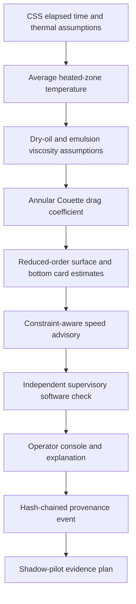
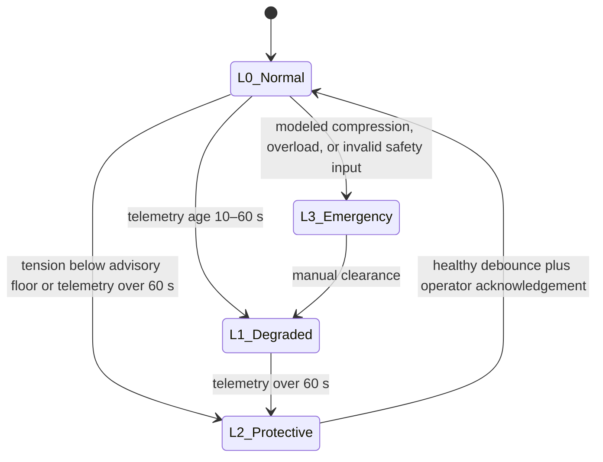

# VectroSync
## Evidence-aware CSS–SRP advisory digital twin research prototype

[](https://vectrosync.vercel.app)
[](https://vectrosync-digital-twin.vercel.app)
[](#verification)
[](#safety-and-evidence-boundary)
[](#local-setup)
[](#operator-console)

VectroSync is a full-stack research demonstrator for **Cyclic Steam Stimulation (CSS)** and **Sucker Rod Pumping (SRP)** surveillance. It connects a thermal-decay model, temperature/water-cut viscosity assumptions, annular-drag estimates, reduced-order dynamometer cards, a constraint-aware speed governor, supervisory trip logic, telemetry ingestion, provenance, and commercial sensitivity analysis in one inspectable workflow.

The project’s strongest contribution is **evidence-aware integration**: every API simulation identifies itself as synthetic, reports its model class and validation status, distinguishes advisory commands from displayed pre-trip scenarios, and exposes infeasibility instead of claiming a false optimum.

> [!IMPORTANT]
> **Research prototype — synthetic model output — advisory only.** This repository includes no field dataset, trained PINN artifact, hardware-in-the-loop report, Modbus control implementation, functional-safety certification, or evidence of operator deployment. It must not command a PLC/VFD or receive safety credit. Oil India Limited and Baghewala references describe a synthetic case study; no sponsorship, endorsement, affiliation, or field validation is implied.

## Why this problem matters

Thermal recovery changes fluid mobility over time. In a reciprocating rod-lift system, changing viscosity, water cut, fillage, geometry, speed, and downhole boundary conditions can materially alter surface and bottom load signatures. Existing workflows often separate reservoir assumptions, lift surveillance, control advice, data quality, and economics.

VectroSync explores a single causal workflow:



## What is implemented

| Capability | Implementation | Honest status |
|---|---|---|
| Thermal model | Bessel-quadrature radial factor, vertical factor, empirical heat removal/calibration | Analytical/numerical research model |
| Thermal verification | Fast PCHIP interpolation plus independent quadrature route | Cross-checked by regression test |
| Dry-oil viscosity | Two-point Arrhenius interpolation | Exact only at configured points |
| Emulsion viscosity | Piecewise water-cut multiplier and fixed phase inversion | Synthetic constitutive assumption |
| Annular drag | Couette coefficient with fixed eccentricity multiplier | Reduced-order assumption |
| Rod cards | 144-phase algebraic force balance over a tapered-string geometry | Reduced-order synthetic estimator; not a time-marched PDE |
| Depth/phase map | Endpoint-load interpolation divided by section area | Comparative visualization; not nodal stress recovery |
| Speed governor | 24-step, 12-hour reduced-order reachable trajectory | Advisory; explicit feasibility/residuals |
| Supervisory logic | Four software levels with modeled compression and overload trips | Demonstration only; not a SIS |
| CSV ingestion | Unit inference/conversion, bounded interpolation, range/time/schema gates | Fails closed for control use |
| State estimator | Physics prior and experimental EKF | SIREN untrained by default; not in control path |
| Audit | Thread-safe in-memory SHA-256 event chain | Tamper-evidence demo; not durable or signed |
| Economics | Low/base/high transparent planning assumptions | Commercial hypothesis, not realized value |
| Interfaces | React/Vite console, Streamlit cockpit, FastAPI REST, synthetic WebSocket | Working prototype |

See [`docs/MODEL_CARD.md`](docs/MODEL_CARD.md) for equations, executed paths, intended use, validity limits, and required field validation.

## Defensible novelty

VectroSync does **not** claim that predictive pumping control, digital twins, thermal models, or dynacards are individually new. Its defensible product thesis is the integration of:

1. CSS thermal-state hypotheses;
2. viscosity-sensitive SRP load surveillance;
3. constraint-aware speed advice with explicit infeasibility;
4. operator-readable causal explanations;
5. safety/data-quality gates; and
6. provenance and commercial assumptions in the same decision trace.

That thesis remains subject to prior-art and freedom-to-operate review. The commercialization plan in [`docs/COMMERCIAL_CASE.md`](docs/COMMERCIAL_CASE.md) starts with retrospective validation and read-only shadow mode.

## Mathematical core

### Thermal decay

The implemented uncalibrated temperature is

\[
T_{avg}(t)=T_R+(T_s-T_R)V_r(t)V_z(t)(1-D_f(t)),
\qquad
D_f(t)=\delta\frac{t_d}{t_d+5}.
\]

The radial factor is evaluated by

\[
V_r(b^2)=2\int_0^\infty e^{-b^2y^2}\frac{J_1(y)^2}{y}\,dy,
\qquad b^2=\frac{\alpha t}{r_h^2},
\]

and the vertical factor by

\[
V_z(w)=\operatorname{erf}\left(\frac{h}{\sqrt w}\right)
+\frac{\sqrt w}{h\sqrt\pi}\operatorname{expm1}\left(-\frac{h^2}{w}\right),
\qquad w=4\alpha t.
\]

Small/large argument branches enforce finite asymptotic behavior. `use_fast_spline=False` forces independent quadrature for numerical verification. The `cooling_multiplier` scales diffusivity consistently in the API, Streamlit cockpit, scenario helper, and forecast path.

### Rheology and drag

Dry-oil viscosity is

\[
\ln\mu_o=A+\frac{B}{T_K}.
\]

The current emulsion branch below the configured inversion point is

\[
\mu_m=\mu_o(1+2.5f_w+10.05f_w^2), \qquad f_w\le0.60.
\]

Above 0.60, the model decays empirically toward water viscosity. This is intentionally described as a synthetic constitutive assumption—not a general non-Newtonian or universally validated Brinkman–Vand law.

Annular Couette drag per unit length is represented by

\[
\beta=\frac{2\pi\epsilon_f\mu_m}{\ln(r_t/r_r)},
\qquad F_{drag}=\beta L v.
\]

### Rod cards and depth map

`ConservativeRodWaveSolver` is retained for API compatibility, but `simulate_card` currently evaluates a phase-resolved **algebraic reduced-order load balance**. Mesh, taper, mass, harmonic-face-area, and CFL utilities exist, but the production card path does not integrate the elastodynamic wave equation in time.

The depth heatmap linearly interpolates surface and bottom card loads and divides by local area. It is useful for comparative visualization, not for Euler/helical buckling, tubing contact, fatigue life, or nodal stress certification.

### Constraint-aware governor

The fast governor uses a 24 × 0.5-hour horizon. It applies:

- configured SPM bounds;
- a slew limit in SPM/hour × step duration;
- reduced-order minimum-tension and PPRL constraints;
- backward reachability to anticipate future speed reductions.

Every result includes:

- `solver_status`: `OPTIMAL` or `INFEASIBLE_SAFE_FALLBACK`;
- `is_anti_float_satisfied`;
- minimum tension/PPRL residuals;
- violating and intrinsically infeasible horizon steps;
- `certified_for_direct_control: false`.

The API then checks the proposed speed against the same card model displayed to the user before assigning supervisory state. This does not eliminate common-model uncertainty; field use still requires an independent plant model and independent SIS.

## Safety and evidence boundary

The software state machine demonstrates four levels:



This state machine is **not IEC 61511 compliant**, is not an independent protection layer, and must remain outside the final safety authority. A field architecture should place hard trips, permissives, and actuator envelopes in independently engineered PLC/SIS logic.

The structured assurance argument is in [`docs/ASSURANCE_CASE.md`](docs/ASSURANCE_CASE.md).

## Operator console

The React console includes:

- synthetic scenario comparison;
- animated wellbore view;
- surface and downhole card studio;
- depth/phase load-derived stress visualization;
- 12-hour model horizon;
- CSV ingestion and control-validity warnings;
- hash-chain explorer;
- explanatory trace;
- low/base/high commercial planning assumptions.

The UI visibly labels all outputs as synthetic/advisory, displays API failures with retry behavior, uses semantic tab/dialog roles, honors reduced-motion preferences, and avoids external font dependencies.

## API

Canonical routes use the `/api` namespace:

| Method | Route | Purpose |
|---|---|---|
| `GET` | `/api/health` | Liveness and prototype classification |
| `GET` | `/api/scenarios` | Synthetic presets |
| `POST` | `/api/scenarios/{id}/apply` | Run a preset |
| `POST` | `/api/simulate` | Run a custom deterministic pass |
| `POST` | `/api/csv/ingest` | Parse and quality-gate CSV data |
| `GET` | `/api/audit/verify` | Verify current in-memory hash chain |
| `WS` | `/ws/live-stream` | Synthetic 25 Hz stream, marked `control_valid=false` |

Simulation responses include:

```json
{
  "control_authority": "advisory_only_not_for_direct_actuation",
  "advisory_command_spm": 2.8,
  "model_status": {
    "data_provenance": "synthetic",
    "rod_model": "reduced_order_algebraic_card_estimator",
    "controller": "constraint_aware_reduced_order_governor",
    "field_validated": false,
    "hil_validated": false
  }
}
```

Set `VECTROSYNC_API_KEY` to require `X-API-Key` on simulation, scenario, ingestion, and audit routes. Use a reverse proxy; never embed secrets in frontend code. See [`SECURITY.md`](SECURITY.md).

## Telemetry quality gate

CSV ingestion now inhibits control validity when it encounters:

- no timestamp or non-unique/out-of-order timestamps;
- missing position/load channels;
- low-confidence mappings;
- unresolved NaN/infinite values;
- excessive interpolation gaps or missing edge values;
- configured physical-range violations;
- ambiguous units.

The parser returns normalized values, mapping confidence, imputation masks, warnings, and `control_valid`. User-supplied data tagged `[measured]` is not automatically authenticated as genuine field data.

## Commercial sensitivity

The API reports a low/base/high planning model rather than one unsupported ROI headline. Each case exposes all assumptions and keeps these value drivers separate:

- avoided workover events;
- metered energy reduction;
- production deferment recaptured during avoided downtime;
- annual platform cost.

All values are labeled `commercial_hypothesis_not_field_validated`. Replace them with finance- and operator-approved evidence before investment decisions. See [`docs/COMMERCIAL_CASE.md`](docs/COMMERCIAL_CASE.md).

## Architecture

```text
frontend/                 React 18 + Vite operator console
backend/server.py         FastAPI API and synthetic WebSocket
src/thermal.py            Thermal research model + quadrature verification path
src/rheology.py           Arrhenius and empirical emulsion/drag assumptions
src/rod_conservative.py   Reduced-order card estimator + mesh/CFL utilities
src/pump_boundary.py      Reduced-order pump boundary
src/controller.py         Constraint-aware advisory governor
src/failsafe.py           Supervisory software demonstration
src/adapter.py            Fail-closed telemetry normalization
src/audit.py              Thread-safe in-memory hash chain
src/economics.py          Low/base/high planning model
src/state_estimator.py    Experimental prior/EKF module
tests/                    Unit, boundary, integration, and assurance regressions
docs/                     Model card, assurance case, and pilot/commercial plan
configs/                  Synthetic case-study assumptions
```

## Local setup

### Prerequisites

- Python 3.11 or 3.14
- Node.js 20

```bash
python3 -m venv .venv
source .venv/bin/activate
pip install -r requirements-dev.txt
npm ci --prefix frontend
```

Run the API and built console:

```bash
npm run build --prefix frontend
python -m uvicorn backend.server:app --host 127.0.0.1 --port 8000
```

Open `http://127.0.0.1:8000`.

Run the engineering cockpit separately:

```bash
streamlit run app.py --server.address 127.0.0.1 --server.port 8501
```

## Container deployment

The container uses a deterministic npm build, exact Python dependencies, targeted source copies, a non-root user, and no compiler in the runtime image. Compose runs API and Streamlit as separate processes with capability drops, read-only filesystems, resource limits, and localhost-only published ports.

```bash
docker compose up --build
```

- API/React: `http://127.0.0.1:8000`
- Streamlit: `http://127.0.0.1:8501`

This remains a local research deployment, not an OT production architecture.

## Verification

Run:

```bash
pytest -q
npm run build --prefix frontend
```

The current suite contains **272 passing tests** after adding assurance regressions for:

- explicit governor infeasibility under extreme viscosity;
- thread-safe concurrent audit appends;
- invalid empty ledgers;
- unknown telemetry schemas and impossible loads;
- correct `load_n` unit handling;
- spline-versus-quadrature thermal agreement;
- traceable economic arithmetic and sensitivity ordering;
- non-finite estimator rejection;
- API assurance metadata and consistent modeled trip behavior;
- stroke-length propagation into generated cards.

Passing tests demonstrate software behavior and selected mathematical properties—not field accuracy, HIL readiness, functional safety, or realized economics.

CI runs Python 3.11/3.14 tests and the locked frontend build via [`.github/workflows/ci.yml`](.github/workflows/ci.yml).

## Roadmap to a defensible field pilot

1. **Typed, operator-approved configuration:** one source for geometry, limits, fluid properties, and units.
2. **Data qualification:** synchronized historian, dynacard, temperature, pressure, PVT, well-test, and intervention records.
3. **True transient rod solver:** manufactured solutions, grid/time convergence, conservation residuals, taper transmission benchmarks.
4. **Model validation:** blinded wells/cycles, residual diagnostics, confidence intervals, drift monitoring.
5. **Uncertainty-aware control:** independent plant model, robust constraints, explicit safe fallback, Monte Carlo campaigns.
6. **Shadow mode:** read-only recommendations, operator acceptance capture, no actuator writes.
7. **HIL and safety lifecycle:** HAZOP/LOPA, MOC, independent SIS, fault injection, cybersecurity approval.
8. **Commercial proof:** matched-well or stepped-wedge pilot with approved allocation and metering rules.

## Documentation

- [`docs/MODEL_CARD.md`](docs/MODEL_CARD.md) — implemented equations, status, limits, validation gates
- [`docs/ASSURANCE_CASE.md`](docs/ASSURANCE_CASE.md) — claims, evidence, defeaters, release gate
- [`docs/COMMERCIAL_CASE.md`](docs/COMMERCIAL_CASE.md) — positioning, sensitivity, pilot design, metrics
- [`SECURITY.md`](SECURITY.md) — threat boundary and required production controls
- [`CONTRIBUTING.md`](CONTRIBUTING.md) — evidence and test rules
- [`LICENSE-NOTICE.md`](LICENSE-NOTICE.md) — rights and non-affiliation notice

## License and affiliation

No open-source license grant is included; see [`LICENSE-NOTICE.md`](LICENSE-NOTICE.md). Third-party dependencies retain their own licenses.

Baghewala and Oil India Limited are referenced only as a synthetic research context. No official deployment, sponsorship, endorsement, proprietary field-data access, or validation is asserted.
