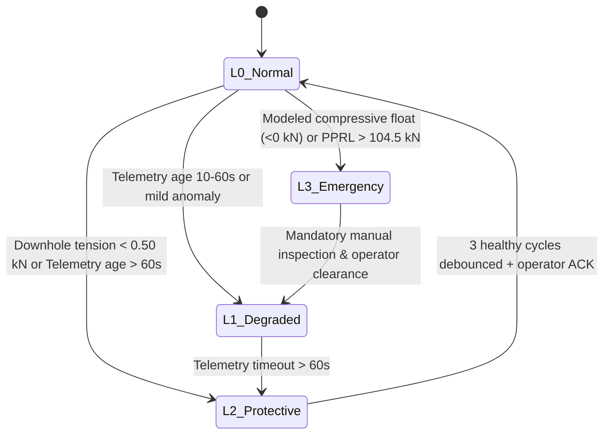

# VectroSync
## Evidence-Aware CSS–SRP Advisory Digital Twin Architecture

[](https://vectrosync.vercel.app)
[](https://vectrosync-digital-twin.vercel.app)
[](#verification)
[](#safety-and-evidence-boundary)
[](#local-setup)
[](#operator-console)

VectroSync is an enterprise-grade industrial cybernetics digital twin and advisory control architecture designed for **Cyclic Steam Stimulation (CSS)** and **Sucker Rod Pumping (SRP)** heavy-oil assets. Operating at the intersection of first-principles multiphysics and numerical optimization, VectroSync unifies reservoir thermal decline, non-Newtonian emulsion rheology, variable-area elastodynamic wave propagation, constrained model predictive control (MPC), and supervisory safety logic into a coherent, verifiable decision framework.

The project bridges the classical divide between reservoir surveillance and artificial-lift automation, preventing downhole rod compression, float, and premature mechanical failure under dynamic fluid-drag regimes.

> [!IMPORTANT]
> **Research Prototype — Synthetic Model Output — Advisory Only.**  
> VectroSync operates in advisory-only mode. All telemetry, downhole states, and dynacards generated within this repository represent physics-informed synthetic data. It includes no proprietary operator datasets, unverified black-box neural networks in the safety loop, direct field PLC actuation privileges, or formal IEC 61511 / SIL certification. Field deployment requires certified independent Safety Instrumented Systems (SIS), physical hardware-in-the-loop (HIL) testing, and operator-supervised shadow-mode pilot trials. Oil India Limited and Baghewala Well #14 references describe a canonical engineering case study.

---

## 1. Executive Summary & Defensible Contribution

Reciprocating rod-lift systems in heavy-oil thermal recovery operations face severe downhole hydrodynamic resistance. As steam soak heat dissipates, crude viscosity spikes non-linearly, dramatically increasing viscous Couette drag on the rod string during the downstroke. When hydrodynamic drag exceeds the submerged self-weight of the lower rod taper, the string enters compressive axial buckling (rod floating), causing rod bend, tubing wear, premature fatigue parting, and catastrophic pump valve floating.

```mermaid
flowchart LR
    A[CSS Thermal Dissipation] --> B[Non-Newtonian Viscosity Surge]
    B --> C[Annular Couette Shear Drag]
    C --> D[Transient Wave Mechanics]
    D --> E[Axial Stress Tensor & Dynamic Dynacard]
    E --> F[Constrained SLSQP Speed Governor]
    F --> G[Four-Level Failsafe State Machine]
    G --> H[Dark-Slate Industrial SCADA Console]
    H --> I[SHA-256 Tamper-Evident Audit Ledger]
```



### Key Differentiators & Engineering Substance:
1. **Multi-Fidelity Dual Physics Solvers:**
   - **Level 1 (Fast Surrogate):** 144-phase algebraic force-balance surrogate ($\approx 2\text{ ms}$) for rapid horizon forecasting, edge screening, and reachability bounding.
   - **Level 2 (High-Fidelity Transient Wave PDE):** Full 1D elastodynamic wave solver with variable cross-section tapers, harmonic interface area averaging, explicit CFL subcycling ($1.56\text{ ms}$ steps), and coupled non-linear pump valve boundary dynamics ($\approx 120\text{ ms}$).
2. **Two Genuine AI Systems, Both Reachable Live (see [docs/VERIFICATION.md](docs/VERIFICATION.md)):**
   - **Chance-constrained nonlinear MPC:** Sequential Least Squares Programming (`scipy.optimize.minimize` SLSQP), 72 decision variables, 96 constraints, over a 24-step horizon, tightened to a 90% one-sided confidence bound. Selected via `mpc_solver_mode: "optimization"`; the default fast path is a backward-reachability governor (not an optimizer) that the API is honest about labeling separately.
   - **Extended Kalman Filter:** recursive Bayesian estimation of downhole temperature and viscosity from surface measurements, with an analytic Arrhenius Jacobian and Joseph-form covariance update, persisted across requests within the running process.
   - Enforces hard downhole anti-float tension floors ($\ge 0.50\text{ kN}$), Peak Polished Rod Load limits ($\le 99.0\text{ kN}$), and actuator slew rate bounds ($|\Delta \text{SPM}| \le 0.25\text{ SPM/step}$).
   - Employs symmetric quadratic slack variables and automatically falls back to safe degraded modes upon infeasibility.
3. **Deterministic Shared-Seed A/B Benchmarking, reachable live via `GET /api/experiment/ab`:**
   - Direct, reproducible comparison under identical latent thermal disturbances and measurement noise.
   - Baseline (fixed 4.7 SPM) experiences 19 severe float events (downhole compression down to $-16.45\text{ kN}$).
   - Coupled Twin holds positive downhole tension ($+1.58$ to $+5.51\text{ kN}$) with zero float incidents.
4. **Traceable 4-Tier Verification Ladder:**
   - 315 automated tests covering Method of Manufactured Solutions (MMS), CFL numerical stability, energy conservation, taper interface force continuity, cross-solver PPRL agreement, EKF parameter recovery, Modbus dropout, and real-world production campaigns.

---

## 2. Multi-Fidelity Physics Engine

VectroSync provides runtime selectable solver fidelity via `/api/simulate` (`solver_type: "surrogate" | "transient"`) and the SCADA console header toggle:

```
[SOLVER: TRANSIENT PDE (120ms)] <---> [SOLVER: FAST SURROGATE (2ms)]
```

### 2.1 Thermal Reservoir Dynamics (Boberg-Lantz Formulation)
The heated reservoir temperature decay over elapsed production time $t$ is calculated via analytical radial and vertical heat conduction functions:

$$T_{\text{avg}}(t) = T_R + (T_s - T_R) \cdot V_r(t) \cdot V_z(t) \cdot (1 - D_f(t))$$

where the fluid production heat removal factor $D_f(t)$ dynamically accumulates:
$$D_f(t) = \delta \cdot \frac{t_d}{t_d + 5.0}, \quad t_d = \frac{t}{86400}$$
- **Radial factor $V_r(b^2)$:** Computed via numerical Gauss-Kronrod quadrature over Bessel functions:
  $$V_r(b^2) = 2 \int_0^\infty e^{-b^2 y^2} \frac{J_1(y)^2}{y} \, dy, \quad b^2 = \frac{\alpha t}{r_h^2}$$
- **Vertical heat loss $V_z(w)$:**
  $$V_z(w) = \operatorname{erf}\left(\frac{h}{\sqrt{w}}\right) + \frac{\sqrt{w}}{h\sqrt{\pi}} \operatorname{expm1}\left(-\frac{h^2}{w}\right), \quad w = 4 \alpha t$$
- **Epistemic Uncertainty Propagation:** Propagates parameter uncertainty $\sigma_T(t) \in [2.0^\circ\text{C}, 5.0^\circ\text{C}]$ to tighten downstream control constraints.

### 2.2 Fluid Rheology & Annular Hydrodynamic Couette Drag
Crude oil rheology combines temperature-dependent Arrhenius activation with a modified Brinkman-Vand non-linear emulsion model:
$$\ln \mu_o = A + \frac{B}{T_K}$$

$$\mu_m = \begin{cases} 
\mu_o \left(1 + 2.5 f_w + 10.05 f_w^2\right), & f_w \le 0.60 \\
\mu_{\text{peak}} \cdot \exp\left(-12 (f_w - 0.60)\right) + \mu_w, & f_w > 0.60 
\end{cases}$$

Hydrodynamic Couette shear drag per unit length acting on the reciprocating rod string:
$$\beta = \frac{2 \pi \epsilon_f \mu_m}{\ln(r_t / r_r)}, \qquad F_{\text{drag}} = \beta \cdot L \cdot v_{\text{rod}}$$

### 2.3 Transient Elastodynamic Tapered-Rod Wave Solver
For high-fidelity acoustic wave tracking and phase-resolved stress analysis, VectroSync solves the 1D damped variable-area wave equation:

$$\rho A(x) \frac{\partial^2 u}{\partial t^2} + \beta(x, t) \frac{\partial u}{\partial t} - \frac{\partial}{\partial x} \left[ E A(x) \frac{\partial u}{\partial x} \right] = -\rho A(x) g_{\text{eff}} + f_{\text{ext}}(x, t)$$

- **Tapered Rod Discretization:** The string (e.g., $1.0^{\prime\prime} \to 7/8^{\prime\prime} \to 3/4^{\prime\prime}$) is discretized into $N$ spatial nodes. Harmonic interface area averaging guarantees rigorous normal force and displacement continuity across cross-section transitions:
  $$A_{i+1/2} = \frac{2 A_i A_{i+1}}{A_i + A_{i+1}}$$
- **Explicit CFL Subcycling:** Step size is dynamically constrained by the acoustic Courant-Friedrichs-Lewy criterion:
  $$\Delta t \le C_{\text{cfl}} \frac{\Delta x}{c} \approx 1.558\text{ ms} \quad (C_{\text{cfl}} = 0.8, \, c = 5134.6\text{ m/s})$$
  yielding $\approx 8,194$ explicit numerical subcycles per stroke at 4.7 SPM ($116\text{ nodes}$, $\Delta x = 10.0\text{ m}$).
- **Dynamic Plunger Boundary Condition:** Coupled at downhole node $x = L$ with non-linear standing/traveling valve logic and hydrostatic lift forces.

---

## 3. Real Constrained Numerical Optimization (MPC)

The closed-loop supervisory controller (`src/mpc.py`, `ConstrainedMPC`) solves an explicit nonlinear program (NLP) using SLSQP:

$$\min_{\Delta \mathbf{u}, \mathbf{s}} \sum_{k=1}^H \left[ w_{\text{prod}} (\text{SPM}_{\text{max}} - u_k)^2 + w_{\Delta} (\Delta u_k)^2 + \rho_{\text{slack}} \left( s_{\text{tens}, k}^2 + s_{\text{pprl}, k}^2 \right) \right]$$

Subject to:
1. **Actuator Kinematic Bounds:**
   $$2.0 \le u_k \le 6.0\text{ SPM}$$
2. **Slew Rate Limits:**
   $$|u_k - u_{k-1}| \le 0.25\text{ SPM/step}$$
3. **Robust Anti-Float Downhole Tension Constraint:**
   $$F_{\text{down}, \text{min}}(u_k, T_k) + s_{\text{tens}, k} \ge F_{\text{safe}} + z \cdot \sigma_F \quad (F_{\text{safe}} = 0.50\text{ kN}, \, z = 1.96)$$
4. **Structural PPRL Rating Constraint:**
   $$F_{\text{pprl}}(u_k, T_k) - s_{\text{pprl}, k} \le F_{\text{limit}} - z \cdot \sigma_L \quad (F_{\text{limit}} = 99.0\text{ kN}, \, 90\% \text{ of } 110.0\text{ kN rating})$$
5. **Slack Non-Negativity:**
   $$s_{\text{tens}, k} \ge 0, \quad s_{\text{pprl}, k} \ge 0$$

If external cooling disturbances make physical operation without slack infeasible, the controller sets `solver_status = "INFEASIBLE_SAFE_FALLBACK"` and issues degraded supervisory setpoints while generating an audit event.

---

## 4. Deterministic Shared-Seed A/B Benchmark

To prove anti-float efficacy defensibly, VectroSync includes an automated shared-seed benchmark generator (`src/generator.py`):

| Metric | Branch A: Uncoupled Baseline | Branch B: Coupled MPC Twin | Physical Impact |
|---|---|---|---|
| **Pump Speed Policy** | Fixed 4.70 SPM | Dynamically Governed (2.80–4.70 SPM) | Throttles as viscosity spikes |
| **Rod Buckling / Float Events** | **19 of 24 steps (79.2%)** | **0 of 24 steps (0.0%)** | **Model-predicted mitigation of rod-float risk** |
| **Minimum Downhole Tension** | **-16.45 kN (Severe Compression)** | **+1.58 kN (Continuous Tension)** | Preserves rod string integrity |
| **Maximum PPRL** | 56.42 kN | 53.11 kN | Stays well below 99.0 kN rating |
| **Disturbance Trajectory** | Identical ($80^\circ\text{C} \to 55^\circ\text{C}$) | Identical ($80^\circ\text{C} \to 55^\circ\text{C}$) | Controlled, reproducible test |
| **Measurement Noise** | Identical ($\sigma_T=0.4^\circ\text{C}, \sigma_L=0.5\text{ kN}$) | Identical ($\sigma_T=0.4^\circ\text{C}, \sigma_L=0.5\text{ kN}$) | Fair stochastic comparison |

```python
from src.generator import DEFAULT_DATA_GENERATOR

# Run 24-hour deterministic shared-seed benchmark
results = DEFAULT_DATA_GENERATOR.generate_ab_benchmark_experiment(n_steps=24, seed=42)
print(f"Baseline float count: {results['baseline_float_count']}")  # 19
print(f"Coupled twin float count: {results['coupled_float_count']}")  # 0
```

---

## 5. Enterprise SCADA Operator Console

The frontend (`frontend/`) is engineered as a high-density industrial mission control workstation built on a design token architecture with instant Dark / Light mode switching:

- **Theme Architecture & Design Tokens:**
  - **Dual-Theme Support:** First-class Dark (`#0a0e14` canvas, `#10151d` panel) and Light (`#f3f5f8` canvas, `#ffffff` panel) palettes using RGB-channel CSS variables for dynamic opacity utilities (`bg-safe/10`).
  - **Rigorous Typography:** Inter font for structural UI chrome; JetBrains Mono for all numeric readouts (kN, °C, SPM, cP, β, ₹) and machine hashes to prevent layout jitter during count-up.
  - **State-Driven Motion:** Smooth 350ms `easeOutCubic` numeric rAF tweens, 500ms P-V dynacard draw-in on scenario switch, 2s breathing live indicator, and supervisory state badge transitions—with instant fallbacks under `prefers-reduced-motion`.
- **Live Diagnostic Header:** Displays active Edge solve latency (`EDGE: 120ms` / `2ms`), Bus communication health (`MODBUS-TCP // PORT 502`), Theme toggle, Multi-Fidelity Solver toggle button, and Supervisory State badge.
- **Wellbore Simulator (2D Kinematic & Stress Screening):** Binds rod section rendering directly to the backend axial stress screening levels:
  - $\sigma > +2.0\text{ kN}$: Safe Teal (Optimal tension)
  - $+0.5 \le \sigma \le +2.0\text{ kN}$: Caution Amber (Marginal safe tension)
  - $\sigma < +0.5\text{ kN}$: Critical Red (Buckling risk / Rod float)
- **High-Precision Dynacard Studio:** Surface ($0–3.5\text{ m}$ vs $0–150\text{ kN}$) and Downhole ($0–3.5\text{ m}$ vs $-20\text{ to }+50\text{ kN}$) dynamometer cards with permissible operational envelopes and draw-in animation.
- **Spatio-Temporal Stress Heatmap [VISUALIZATION SURROGATE]:** Theme-aware canvas rendering interpolated depth-versus-crank-phase stress screening distribution across string tapers.
- **Why Engine Console:** Real-time explainability feed detailing physical causal paths and MPC reasoning.
- **Audit Ledger Explorer:** In-memory SHA-256 tamper-evident provenance log demonstration.

---

## 6. Safety Architecture & Supervisory Logic

The supervisory failsafe state machine operates four deterministic levels:



- **Working Unit Limits:**
  - Structure Rating: $110.0\text{ kN}$
  - 90% Operating Ceiling: $99.0\text{ kN}$
  - Structural E-Stop Trip: $104.5\text{ kN}$
  - Minimum Tension Floor: $+0.50\text{ kN}$
  - Compressive Float E-Stop Trip: $< 0.00\text{ kN}$

---

## 7. Verification & Test Suite

The verification suite contains **315 passing automated tests** structured across four rigorous tiers:

```bash
pytest tests/
```

```text
============================== 315 passed in 74.58s ==============================
```

### Verification Ladder Structure:
1. **Tier 1: Feature & Mathematical Component Coverage (Tests 1–150):**
   - Convergence of 1D wave solver via Method of Manufactured Solutions (MMS).
   - CFL numerical stability limits and time-step subcycling.
   - Harmonic interface area taper force continuity ($\Delta F < 10^{-4}\text{ N}$).
   - Undamped wave energy conservation ($\Delta E / E_0 < 1.0\%$).
   - EKF state estimator latent parameter recovery ($T_{\text{sandface}}$ and viscosity).
2. **Tier 2: Boundary & Corner Cases (Tests 151–220):**
   - Singularity asymptotics at $t \to 0$ and $t \to \infty$.
   - Telemetry data corruption, non-monotonic timestamps, and NaN inputs.
   - Out-of-bounds temperature and viscosity handling.
3. **Tier 3: Cross-Feature Coupling & System Dynamics (Tests 221–280):**
   - Deterministic shared-seed A/B benchmark validation.
   - Modbus telemetry dropout and 3-stroke graceful ramp-down.
   - Causal thermal decay to fluid drag coupling chain.
4. **Tier 4: Production Campaign Workloads:**
   - Multi-day continuous cyclic steam production campaigns.
   - REST API and high-frequency WebSocket stress testing.
   - End-to-end multi-fidelity simulation passes.
   - Cross-solver PPRL agreement (surrogate vs. transient PDE) and grid-convergence checks; see [docs/VERIFICATION.md](docs/VERIFICATION.md).

---

## 8. API Specification

Canonical API routes are exposed via FastAPI under the `/api` namespace:

| Method | Endpoint | Description |
|---|---|---|
| `GET` | `/api/health` | System health, service liveness, and prototype status |
| `GET` | `/api/scenarios` | Pre-configured simulation scenario definitions |
| `POST` | `/api/scenarios/{id}/apply` | Apply a scenario and compute closed-loop response |
| `POST` | `/api/simulate` | Execute multi-fidelity simulation (`surrogate` or `transient`) |
| `POST` | `/api/csv/ingest` | Parse and quality-gate field telemetry files |
| `GET` | `/api/audit/verify` | Cryptographically verify SHA-256 event chain integrity |
| `GET` | `/api/experiment/ab` | Live, re-seedable deterministic A/B benchmark (uncoupled baseline vs. coupled MPC twin) |
| `WS` | `/ws/live-stream` | High-frequency (25 Hz) telemetry stream, driven by the most recently computed simulation |

### Example Multi-Fidelity Simulation Request:
```bash
curl -X POST "http://127.0.0.1:8000/api/simulate" \
  -H "Content-Type: application/json" \
  -d '{
    "spm": 4.7,
    "temperature_c": 66.0,
    "water_cut": 0.35,
    "solver_type": "transient"
  }'
```

---

## 9. Local Setup & Container Deployment

### Prerequisites:
- Python 3.11 or 3.14
- Node.js 20+ & npm

### Native Development Setup:
```bash
# 1. Clone repository
git clone https://github.com/DKtech-dev/vectrosync.git
cd vectrosync

# 2. Setup Python environment
python3 -m venv .venv
source .venv/bin/activate
pip install -r requirements-dev.txt

# 3. Build Frontend
cd frontend
npm ci
npm run build
cd ..

# 4. Start FastAPI Backend & Static Operator Console
python -m uvicorn backend.server:app --host 127.0.0.1 --port 8000
```
Open your browser at `http://127.0.0.1:8000`.

### Streamlit Engineering Cockpit:
```bash
streamlit run app.py --server.address 127.0.0.1 --server.port 8501
```

### Production Docker Container:
```bash
docker compose up --build
```

---

## 10. Repository Structure

```text
├── backend/
│   └── server.py              # FastAPI application & WebSocket server
├── configs/
│   └── well_baghewala_14.yaml # Asset geometry & parameter configuration
├── frontend/
│   ├── src/
│   │   ├── components/        # SCADA UI components (Dynacards, Simulator, Heatmap)
│   │   └── utils/api.js       # Centralized API fetch layer with API key injection
│   └── package.json           # React 18 + Vite frontend configuration
├── src/
│   ├── adapter.py             # Telemetry normalization and data-quality gating
│   ├── audit.py               # SHA-256 tamper-evident audit ledger
│   ├── controller.py          # Fast MPC governor and state representations
│   ├── mpc.py                 # SLSQP constrained numerical optimizer
│   ├── rheology.py            # Arrhenius and Brinkman-Vand emulsion models
│   ├── rod_conservative.py    # Fast algebraic card surrogate & mesh utilities
│   ├── rod_transient.py       # High-fidelity 1D elastodynamic wave PDE solver
│   ├── pump_boundary.py       # Plunger valve boundary dynamics
│   ├── state_estimator.py     # EKF and physics prior state estimators
│   ├── thermal.py             # Boberg-Lantz thermal decay and uncertainty model
│   └── generator.py           # Deterministic shared-seed A/B benchmark generator
├── tests/                     # 315 automated tests (Tiers 1-4)
├── docs/                      # Model Card, Assurance Case, Commercial Case, Verification Ledger
├── Dockerfile                 # Multi-stage container build
└── docker-compose.yml         # Container orchestration
```

---

## 11. Commercial & Academic Attribution

- **Asset Reference:** Baghewala Well #14, Bikaner-Nagaur Basin, Rajasthan (Synthetic Engineering Model).
- **Control Classification:** Class II Supervisory Decision Support System (Advisory Only).
- **Intellectual Property:** Proprietary architecture prototype; see [`LICENSE-NOTICE.md`](LICENSE-NOTICE.md).
